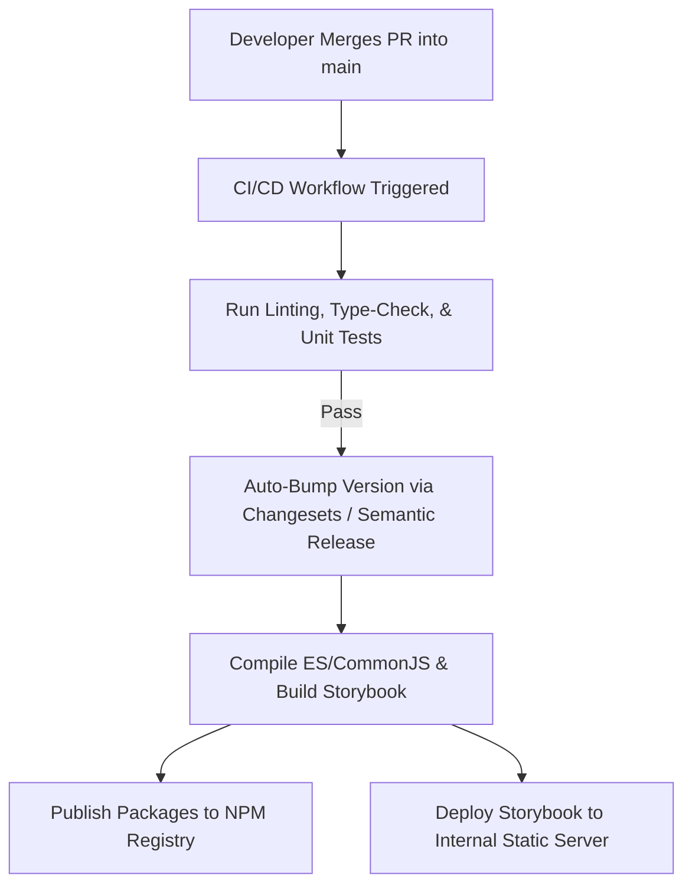

# Handover & Enterprise Production-Ready Guide
**A Step-by-Step Strategy for Migrating from Personal Proof-of-Concept to Company Organization Ownership**

This guide outlines the critical steps across **DevOps, Engineering, Management, and Design** to transition the Xectec Design System from a personal workspace into a secure, production-grade enterprise asset.

---

## 1. DevOps & Infrastructure Handover

### A. Transfer GitHub Repository Ownership
1. **Transfer Repository**: Navigate to `Settings -> Danger Zone -> Transfer Ownership` in the GitHub UI, and transfer the repository to the official company organization (e.g., `github.com/xectec-org/xectecDesignSystem`).
2. **Setup Teams & Access Controls**:
   * **Core Design System Team**: Admin/Write access (engineers responsible for building design system primitives).
   * **Product Developers**: Read access (engineers who consume `@xectec/ui` and `@xectec/tokens` inside dashboards).
   * **CI/CD Service Accounts**: Write/Publish access.

### B. Setup Enterprise Package Distribution (NPM Registry)
Currently, packages are published via personal accounts. For enterprise production:
1. **Select Registry**: Decide where to host private packages:
   * **NPM Org**: Create a private team organization on `registry.npmjs.org` (e.g. `@xectec`).
   * **Self-hosted / Private Registries**: Configure publishing to JFrog Artifactory, AWS CodeArtifact, or GitHub Packages.
2. **Rename Scopes**: If the scope name changes, update the name property in `package.json` configurations (e.g. `@xectec/tokens` or `@yourcompany/tokens`).
3. **Configure Authentication (.npmrc)**: Add authentication tokens inside your CI/CD variables (never hardcoded in files).

---

## 2. CI/CD Release Automation (DevOps & Engineering)

To prevent manual version bumps and registry publish steps, automate the release pipeline using **GitHub Actions**:

### Key Tools to Integrate:
* **Changesets (Highly Recommended)**: A monorepo-friendly tool that manages package version bumps and generates `CHANGELOG.md` files automatically based on developer pull request notes.
* **Release Workflow (GitHub Action)**:
  * Triggers on merges to `main`.
  * Runs linting, testing (`pnpm test`), and workspace compilation (`pnpm build`).
  * Executes `pnpm publish` using a registry token stored in GitHub Actions Secrets.

---

## 3. Storybook Deployment & Accessibility (Managers & Devs)

Storybook is your visual contract between Designers, Product Managers, and Developers.

1. **Deploy Storybook Static Site**: Add a step in the CI/CD pipeline to deploy the compiled `apps/storybook/storybook-static/` assets to a cloud storage bucket (e.g. AWS S3 + CloudFront, Vercel, Netlify, or an internal server).
2. **Secure the Site (SSO/VPN)**: Restrict access to the hosted Storybook using your company's VPN or Single Sign-On (SSO) configuration (e.g. Cloudflare Access, Okta) so the design language and mockups remain secure.
3. **Publishing Guidelines**: Host the Storybook link inside your developer wiki/confluence space for easy discoverability.

---

## 4. Figma-to-Code Design Alignment (Designers & Devs)

To bridge the gap between design mockups and actual product layouts:
1. **Centralized Figma Component Library**: Design leads must build a Figma library matching our React component API specs (same variant properties, states, sizes, icons).
2. **Design Tokens Synchronization**:
   * Align Figma variables with Xectec design token variables.
   * Introduce tools like **Figma Tokens Studio** to export variable definitions as JSON.
   * Configure the design system monorepo to read this JSON and compile it directly into `@xectec/tokens/tokens.css`, creating a seamless pipeline from canvas to code.

---

## 5. Security & Quality Safeguards

Before going live:
1. **Branch Protection Rules**: Protect `main`. Require:
   * At least one code review approval.
   * Passing status checks (linting, tests, build success).
   * Signed commits (optional but recommended for corporate audits).
2. **Dependency Vulnerability Scanning**: Run automated vulnerability scans (e.g., Snyk, GitHub Dependabot) to flag security risks in external dependencies (like Radix UI libraries).
3. **npm Audit Gates**: Fail PR builds if dependencies contain high or critical vulnerabilities.

---

## 6. Feedback & Governance Model

To prevent fragmented development going forward:
* **Feedback Channels**: Set up a dedicated Slack/Teams channel (e.g., `#design-system-support`) where product developers can ask questions or report layout issues.
* **Change Request Process**: Product developers should not copy-paste local fixes. If a component lacks a variant, they must submit a PR to the design system monorepo.
* **Steering Committee**: Form a small committee of 1 Designer, 1 DevOps Engineer, and 2 Tech Leads to meet bi-weekly and prioritize component requests.
