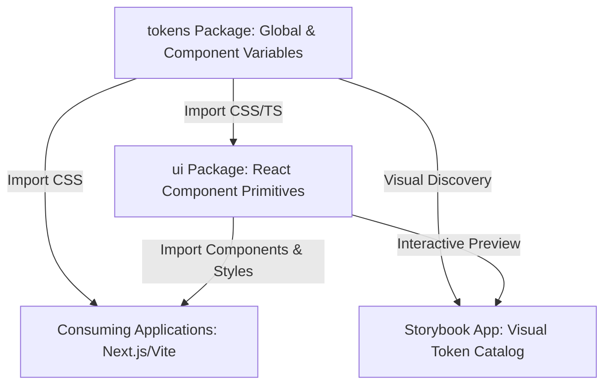
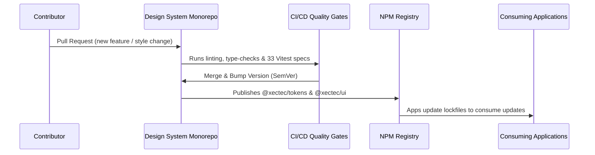

# Centralized Design System Proof-of-Concept (POC) Overview
**A Professional Proposals Guide for Centralizing Brand Identity and Accelerating Development**

---

## 1. Project Overview

The **Xectec Design System** is an enterprise-grade, centralized monorepo hosting our core design tokens (`@xectec/tokens`) and modular React component primitives (`@xectec/ui`), fully documented through an interactive Storybook platform.

### Scope & Goals
* **Establish a Single Source of Truth**: Decouple layout and style variables (colors, fonts, spacings, shadows) from independent application codebases.
* **Accelerate Delivery**: Provide pre-built, accessible, and tested primitives so developers focus on business logic rather than writing basic CSS.
* **Hardlock Corporate Styling**: Ensure that all current and future portals, dashboards, and client-facing interfaces adhere strictly to corporate branding guidelines.



---

## 2. Core Features

Our design system is built using modern engineering standards, including:
* **Centralized Token Scales**: Defined color ranges (Primary, Secondary, Success, Warning, Error, Neutrals), typography families, layout spacing levels, border radii, and z-index layers.
* **Component-Level Override Mapping**: Mapped CSS variables (like `--color-button-primary-bg` and `--spacing-input-padding-x-md`) which isolate component styles, allowing visual updates without changing JavaScript code.
* **Radix UI Accessibility Primitives**: Components (Modals, Toasts, Inputs) built on Radix UI to ensure out-of-the-box keyboard accessibility (WAI-ARIA compliant, focus trapping).
* **Dynamic Theme Toggle (Dark & Light Mode)**: Fully integrated overrides shifting visual values automatically based on the document's `data-theme` attribute.
* **Scoped Styling with CSS Modules**: Component styles are hashed (e.g., `_button_1a2b3_c4d5e`) to ensure zero stylesheet pollution or variable collisions in consuming applications.

---

## 3. Business & Technical Benefits

Integrating this architecture yields significant advantages:
* **Developer Velocity**: Saves up to **40% of front-end development time** by eliminating the need to write custom button, modal, or input code for new pages.
* **Absolute Brand Consistency**: Prevents visual drifts between different portals. If a corporate color or corner radius changes, updating a single design token updates all consuming apps simultaneously.
* **Compliance Safeguards**: Ensures that all customer-facing panels are fully accessible and mobile-responsive right out of the box.
* **Clean Codebases**: Drastically reduces stylesheet sizes inside product applications, keeping their repositories free of redundant layout variables.

---

## 4. How to Integrate

Consuming apps can bootstrap the design system in minutes:

### Step 1: Install Packages
Install version `0.1.3` of the tokens and components from our registry:
```bash
npm install @xectec/tokens@0.1.3 @xectec/ui@0.1.3
# Or with pnpm:
pnpm add @xectec/tokens@0.1.3 @xectec/ui@0.1.3
```

### Step 2: Global Styling Import
Add the core styling sheets to your root application layout (e.g., `layout.js` in Next.js or `main.tsx` in Vite React):
```javascript
// Import core design token CSS variables
import "@xectec/tokens/tokens.css";

// Import compiled component stylings
import "@xectec/ui/styles.css";

// Import your application's global styles
import "./globals.css";
```

### Step 3: Tailwind v4 Theme Mapping (Optional)
If using Tailwind CSS v4, map Tailwind's `@theme` rules to the design tokens inside `globals.css`:
```css
@theme inline {
  --color-background: var(--color-sidebar-bg);
  --color-foreground: var(--color-sidebar-text);
  --spacing-layout-pad: var(--spacing-element-padding-xs); /* 4px */
}
```

---

## 5. How to Maintain

A design system is a living product. We maintain long-term stability using a robust release pipeline:



### Contribution & Updates
* **Pull Request Reviews**: All modifications require peer review to ensure code quality.
* **Automated CI Gates**: Every PR runs automated code linting, typescript validation, and **33 unit tests** (assuring component logic and rendering stability).
* **Versioning Policy**: We enforce strict Semantic Versioning (SemVer):
  * **Patch Bumps (`0.1.x`)**: Backward-compatible visual changes or layout token adjustments.
  * **Minor Bumps (`0.x.0`)**: Introducing new component primitives or compatible token parameters.
  * **Major Bumps (`x.0.0`)**: Breaking API alterations.

---

## 6. System Scalability

Our design system is architected to scale to dozens of consuming apps and teams:
* **Dualesm/CJS Output formats**: Compiled using Vite to both ES Modules (`dist/index.js`) and CommonJS (`dist/index.cjs`) with full declaration maps, supporting both legacy and modern bundlers (Next.js, Vite, Webpack).
* **Framework Agnostic Primitives**: The design token library is purely CSS/JSON, allowing it to be consumed by React, Vue, Angular, or raw HTML pages.
* **Design-to-Code Sync**: Token variables are aligned with design files in Figma, allowing designers to export visual changes directly to the codebase via JSON translation pipelines.

---

## 7. Metrics & Comparison

| Feature Capability | Standard Development (Ad-Hoc Styling) | Centralized Design System |
| :--- | :--- | :--- |
| **Component Discovery** | Devs search existing codebases for reuse options. | Storybook acts as a single visual directory. |
| **Visual Consistency** | Stylists inspect screens manually; variations occur. | Enforced by the core tokens package. |
| **Style Collision Risk** | Global CSS rules often overwrite and break layouts. | Scoped CSS Modules isolate styling completely. |
| **Theme Swapping Cost** | High—requires manual theme mapping in each app. | Low—toggle `<html data-theme="dark">` to flip theme. |
| **Upgrade Propagation** | Changes must be manually copy-pasted across repos. | Run `pnpm update` to push updates instantly. |

---

## 8. Summary & Next Steps for Approval

This POC demonstrates that the centralized design system successfully addresses styling fragmentation, improves developer velocity, and guarantees WAI-ARIA compliance.

### Actionable Next Steps
1. **Approve Workspace Adoption**: Formally adopt `@xectec/tokens` and `@xectec/ui` inside our core portals.
2. **Host Visual Storybook**: Publish the static Storybook site internally so engineers, designers, and managers share a common visual playground.
3. **Establish Token Governance**: Assign token management ownership to design leads and front-end architects.
